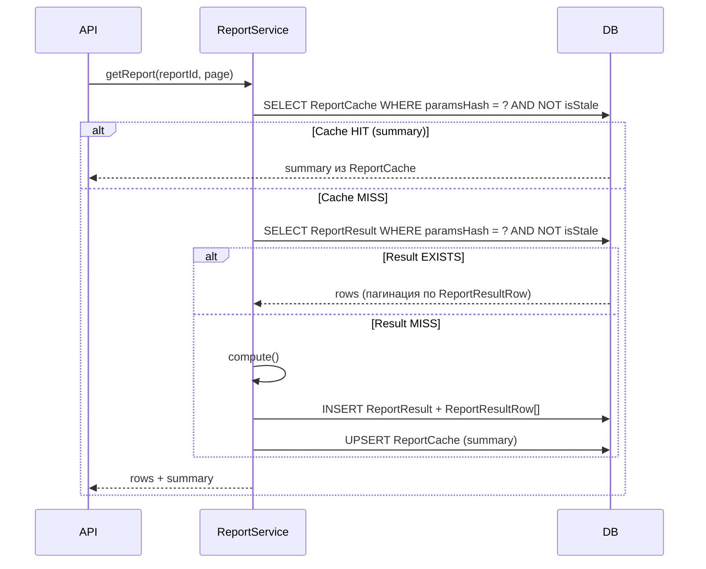
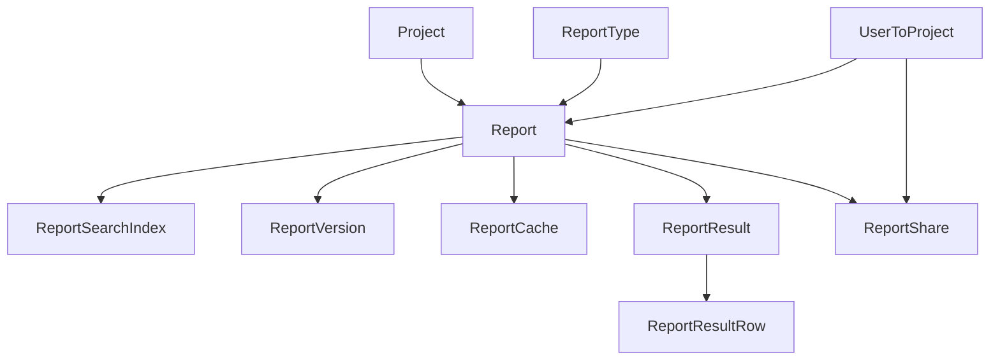

# Архитектура аналитических отчётов — Гибридный вариант (доработанный)

## Контекст: существующая схема

Ключевые сущности для фильтрации отчётов:

- `Project` → `Strategy` → `Channel` → `UfChannel`, `MetricChannel`
- `Channel` → `ChannelPerformance` → `ChannelPerformanceMetricResult`, `ChannelPerformanceUfChannelResult`
- `ChannelSource` (trafficSource у Channel)
- RBAC: `User` → `UserToProject` → `Role` → `RolePermission` → `Permission`

---

## Принципы доработанного варианта

1. `Report` хранит **только критичные нормализованные поля** — `dateFrom`, `dateTo`, `projectId`, `ownerId`, `visibility`; всё остальное в `config JSONB`
2. `ReportSearchIndex` — отдельная таблица с вычисляемыми полями для фильтрации списка (обновляется триггером или сервисом)
3. `ReportVersion` хранит **только diff** (JSON Patch RFC 6902) и создаётся по требованию, не на каждое сохранение
4. `config` строго типизирован: каждый `ReportType` несёт `configSchema JSONB` (JSON Schema Draft-07), валидация на бэкенде через `ajv`
5. Тяжёлые результаты расчётов — в `ReportResult` (партиционирование по `computedAt`), не в `ReportCache`; `ReportCache` — только лёгкий кэш агрегатов

---

## Таблицы

### ReportType — реестр типов отчётов

```
ReportType {
  id          BigInt   @id @default(autoincrement())
  code        String   @unique            // "channel_performance", "funnel", "cohort"
  name        String
  description String?
  category    String                      // "performance" | "funnel" | "cohort" | "comparison"
  configSchema JSONB                      // JSON Schema Draft-07 для валидации config
  isBuiltIn   Boolean  @default(false)
  createdAt   DateTime @default(now())
  updatedAt   DateTime @updatedAt
}
```

`configSchema` — единственный источник правды для frontend (динамически строит форму) и для бэкенда (валидация через `ajv`).

---

### Report — основная таблица

Только минимально необходимые нормализованные поля:

```
Report {
  id             BigInt   @id @default(autoincrement())
  projectId      BigInt                        // индексируется
  reportTypeCode String                        // → ReportType.code
  name           String
  slug           String                        // для URL

  // Критичные нормализованные поля (часто используются в WHERE списка):
  dateFrom   DateTime?
  dateTo     DateTime?
  ownerId    BigInt                            // → UserToProject.id
  visibility ReportVisibility                  // PRIVATE | PROJECT | PUBLIC

  // Вся остальная конфигурация:
  config     JSONB    @default("{}")           // валидируется по ReportType.configSchema

  // Метаданные:
  isPinned   Boolean  @default(false)
  tags       String[]
  version    Int      @default(1)
  lastRunAt  DateTime?
  createdAt  DateTime @default(now())
  updatedAt  DateTime @updatedAt
  deleted    Boolean  @default(false)

  @@index([projectId, deleted])
  @@index([projectId, dateFrom, dateTo])
  @@index([ownerId])
}

enum ReportVisibility { PRIVATE PROJECT PUBLIC }
```

Что перенесено в `config`: `strategyIds`, `channelIds`, `channelSourceIds`, `groupBy`, `metrics`, `visualization`, и любые будущие параметры.

---

### ReportSearchIndex — материализованные фильтры

Обновляется триггером (или сервисом при сохранении отчёта). Содержит денормализованные поля из `config`, которые нужны для фильтрации списка на странице «Аналитика»:

```
ReportSearchIndex {
  reportId         BigInt   @id              // 1:1 с Report
  strategyIds      BigInt[]                  // GIN-индекс
  channelIds       BigInt[]                  // GIN-индекс
  channelSourceIds Int[]                     // GIN-индекс
  tags             String[]                  // GIN-индекс
  updatedAt        DateTime @updatedAt       // для инвалидации

  @@index([strategyIds], type: Gin)
  @@index([channelIds],  type: Gin)
}
```

Список отчётов с фильтрацией:

```sql
SELECT r.*, rt.name AS typeName
FROM "Report" r
JOIN "ReportType" rt ON r."reportTypeCode" = rt.code
LEFT JOIN "ReportSearchIndex" si ON si."reportId" = r.id
WHERE r."projectId" = $1
  AND r.deleted = false
  AND ($dateFrom IS NULL OR r."dateFrom" >= $dateFrom)
  AND ($strategyId IS NULL OR si."strategyIds" @> ARRAY[$strategyId::bigint])
  AND (r.visibility = 'PROJECT'
    OR r."ownerId" = $currentUserToProjectId
    OR EXISTS (SELECT 1 FROM "ReportShare" s WHERE s."reportId" = r.id
               AND s."userToProjectId" = $currentUserToProjectId))
ORDER BY r."isPinned" DESC, r."lastRunAt" DESC NULLS LAST
```

---

### ReportVersion — diff-версионирование по требованию

Версия создаётся не при каждом `PATCH`, а только явно (кнопка «Сохранить версию» или при публикации отчёта):

```
ReportVersion {
  id          BigInt   @id @default(autoincrement())
  reportId    BigInt
  version     Int
  patch       JSONB                  // JSON Patch (RFC 6902) — diff от предыдущей версии
  snapshot    JSONB?                 // полный снэпшот config (nullable — только для v1 и checkpoint'ов)
  changedById BigInt
  changeNote  String?
  createdAt   DateTime @default(now())

  @@unique([reportId, version])
  @@index([reportId])
}
```

- `patch` содержит массив операций JSON Patch: `[{"op":"replace","path":"/metrics/0","value":"ctr"}]`
- `snapshot` заполняется для первой версии и каждого N-го checkpoint'а (например каждые 10 версий), чтобы не восстанавливать с нуля
- Откат: применить `patch` в обратном порядке или восстановить ближайший `snapshot` + цепочку `patch`'ей

---

### ReportResult — тяжёлые результаты с партиционированием

Отдельная от кэша таблица для хранения вычисленных строк результата. Партиционируется по `computedAt` (диапазоны по месяцам):

```
ReportResult {
  id           BigInt   @id @default(autoincrement())
  reportId     BigInt
  paramsHash   String                   // SHA256 конфига на момент расчёта
  rowCount     Int
  sizeBytes    Int?
  computedAt   DateTime @default(now()) // ключ партиционирования
  expiresAt    DateTime
  isStale      Boolean  @default(false)

  rows         ReportResultRow[]

  @@index([reportId, paramsHash])
  @@index([expiresAt])
}

ReportResultRow {
  id             BigInt @id @default(autoincrement())
  reportResultId BigInt
  rowIndex       Int
  data           JSONB              // одна строка результата

  @@index([reportResultId, rowIndex])
}
```

Партиционирование в PostgreSQL (вне Prisma, через raw SQL при создании):

```sql
CREATE TABLE "ReportResult" (...) PARTITION BY RANGE ("computedAt");
CREATE TABLE "ReportResult_2024_q1" PARTITION OF "ReportResult"
  FOR VALUES FROM ('2024-01-01') TO ('2024-04-01');
```

- Удаление старых результатов = `DROP PARTITION` — без блокировки основной таблицы
- `ReportResultRow` хранит строки отдельно — пагинация без загрузки всего JSONB

---

### ReportCache — лёгкий кэш агрегатов

`ReportCache` остаётся, но только для небольших агрегированных ответов (dashboard KPI, summary), не для полных датасетов:

```
ReportCache {
  id         BigInt   @id @default(autoincrement())
  reportId   BigInt
  paramsHash String
  summary    JSONB                   // агрегаты: totals, chart points
  computedAt DateTime @default(now())
  expiresAt  DateTime
  isStale    Boolean  @default(false)

  @@unique([reportId, paramsHash])
  @@index([expiresAt])
}
```

---

### ReportShare — индивидуальный шеринг

```
ReportShare {
  id              BigInt   @id @default(autoincrement())
  reportId        BigInt
  userToProjectId BigInt?   // null = весь проект (дублирует visibility=PROJECT, но с canEdit)
  canEdit         Boolean   @default(false)
  createdAt       DateTime  @default(now())

  @@unique([reportId, userToProjectId])
}
```

---

## Строгая типизация config через JSON Schema

`ReportType.configSchema` — JSON Schema Draft-07, хранится в БД. Пример для типа `channel_performance_over_time`:

```json
{
  "$schema": "http://json-schema.org/draft-07/schema#",
  "type": "object",
  "required": ["metrics", "groupBy"],
  "additionalProperties": false,
  "properties": {
    "metrics": {
      "type": "array",
      "items": { "type": "string", "enum": ["spend", "impressions", "clicks", "leads", "conversions", "ctr", "cpa"] },
      "minItems": 1
    },
    "groupBy":            { "type": "string", "enum": ["channel", "strategy", "channelSource"] },
    "timeGranularity":    { "type": "string", "enum": ["day", "week", "month"], "default": "week" },
    "compareWithPeriod":  { "type": "boolean", "default": false },
    "strategyIds":        { "type": "array", "items": { "type": "integer" } },
    "channelIds":         { "type": "array", "items": { "type": "integer" } },
    "channelSourceIds":   { "type": "array", "items": { "type": "integer" } }
  }
}
```

На бэкенде (NestJS service):

```typescript
import Ajv from 'ajv';
const ajv = new Ajv({ allErrors: true });

async validateConfig(reportTypeCode: string, config: unknown) {
  const type = await this.prisma.reportType.findUniqueOrThrow({
    where: { code: reportTypeCode },
    select: { configSchema: true }
  });
  const validate = ajv.compile(type.configSchema as object);
  if (!validate(config)) {
    throw new BadRequestException(ajv.errorsText(validate.errors));
  }
}
```

---

## Кэширование: разделение на ReportCache и ReportResult



- При изменении `ChannelPerformance`: BullMQ job устанавливает `isStale = true` в `ReportCache` и `ReportResult` для затронутых отчётов
- TTL: `ReportCache` — 5–60 мин; `ReportResult` — 24 ч для исторических, 1 ч для текущих периодов

---

## Версионирование: алгоритм diff

```typescript
import { applyPatch, compare } from 'fast-json-patch';

async saveVersion(reportId, newConfig, userId, note?) {
  const report = await prisma.report.findUniqueOrThrow({ where: { id: reportId } });
  const patch = compare(report.config, newConfig);   // JSON Patch diff

  const isCheckpoint = report.version % 10 === 0;

  await prisma.$transaction([
    prisma.reportVersion.create({
      data: {
        reportId,
        version: report.version,
        patch,
        snapshot: isCheckpoint ? newConfig : undefined,
        changedById: userId,
        changeNote: note,
      }
    }),
    prisma.report.update({
      where: { id: reportId },
      data: { config: newConfig, version: { increment: 1 } }
    })
  ]);
}
```

---

## Права доступа

Трёхуровневая система на базе существующего RBAC:

1. **Системный уровень** (`Permission`): добавить записи с кодами `analytics.view`, `analytics.create`, `analytics.export` → привязать к `Role` через существующий `RolePermission`
2. **Уровень отчёта** (`visibility`): `PRIVATE` / `PROJECT` / `PUBLIC`
3. **Индивидуальный шеринг** (`ReportShare`): конкретный `UserToProject` с флагом `canEdit`

Матрица:

- `PRIVATE` → только `ownerId` или запись в `ReportShare`
- `PROJECT` → все участники проекта с Permission `analytics.view`
- `PUBLIC` → по ссылке (опционально, без аутентификации)

---

## Диаграмма итоговой схемы



---

## Файлы для добавления в prisma/schema/

- `prisma/schema/reportType.prisma`
- `prisma/schema/report.prisma`
- `prisma/schema/reportSearchIndex.prisma`
- `prisma/schema/reportVersion.prisma`
- `prisma/schema/reportResult.prisma`
- `prisma/schema/reportResultRow.prisma`
- `prisma/schema/reportCache.prisma`
- `prisma/schema/reportShare.prisma`
