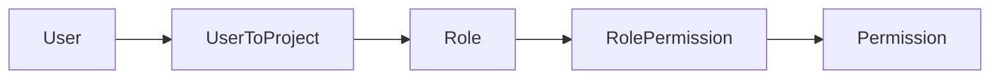

# Гварды прав доступа (Permission) в `src/shared/permissions`

## Контекст данных



- Участник проекта: `[UserToProject](prisma/schema/userToProject.prisma)` (`userId`, `projectId`, `roleId`, `blocked`).
- Права роли: `[RolePermission](prisma/schema/rolePermission.prisma)` с флагом `granted`; связь с `[Permission](prisma/schema/permission.prisma)` по `code` / `id` (в схеме опечатка реляции `persmission` — в Prisma-запросах использовать сгенерированное имя поля из клиента).
- Текущий проект в HTTP: заголовок `x-tenant-id` в CLS и на `request` через `[TenantGuard](src/shared/tenant/guards/tenant.guard.ts)`; перед гвардом прав обязательны `**JwtAuthGuard**` и `**TenantGuard**` (как на `[ProjectUserController](src/modules/projectUser/projectUser.controller.ts)`).

Уже есть `[ProjectAccessGuard](src/modules/project/guards/project-access.guard.ts)`: проверяет `**Role.code**`, не `Permission`; не зарегистрирован в модуле и не используется; в конце `return` без `true`. Новый гвард **не заменяет автоматически** старый — при желании его можно позже удалить или перевести на обёртку над правами.

## Поведение гварда

1. Если на хендлере/классе **нет** метаданных с требуемыми кодами — `true` (как у существующего паттерна в `ProjectAccessGuard`).
2. Иначе: по `request.user.id` (из JWT) и `request.tenantId` найти `**UserToProject` с `blocked: false` для этого `projectId` (Prisma: `projectId: BigInt(String(tenantId))`).
3. Если записи нет или пользователь заблокирован — `403 Forbidden`.
4. Загрузить все `RolePermission` роли с `granted: true`, собрать множество `**Permission.code`.
5. Сравнить с метаданными:

- режим по умолчанию **«все указанные коды» (AND)**;
- дополнительно декоратор **«хотя бы один» (OR)** для редких кейсов.

Иерархия `Permission.parentId`: в `[projectRole.service](src/modules/projectRole/projectRole.service.ts)` выдача хранится **по узлам** (`granted` на каждой строке `RolePermission`). План: **не разворачивать дерево** в гварде — считается выданным только то, что явно `granted: true` (совпадает с UI ролей).

## Файлы в `src/shared/permissions`

| Назначение                      | Файл                                                                                                                                                                                                                                                                                    |
| ------------------------------- | --------------------------------------------------------------------------------------------------------------------------------------------------------------------------------------------------------------------------------------------------------------------------------------- |
| Ключ reflector + тип требования | `[permissions.constants.ts](src/shared/permissions/permissions.constants.ts)` (новый)                                                                                                                                                                                                   |
| Декораторы                      | `[decorators/require-permissions.decorator.ts](src/shared/permissions/decorators/require-permissions.decorator.ts)` (новый)                                                                                                                                                             |
| Загрузка прав                   | Расширить `[permissions.service.ts](src/shared/permissions/permissions.service.ts)`: метод вроде `getGrantedPermissionCodes(userId, projectId): Promise<Set<string>>` (один запрос `findFirst` + `include` по связям выше; учесть имя `persmission` в `include`).                       |
| Гвард                           | `[guards/permissions.guard.ts](src/shared/permissions/guards/permissions.guard.ts)` (новый): `Reflector` + `PermissionsService`, чтение метаданных, проверка AND/OR, при отказе — `ForbiddenException` с нейтральным сообщением (без перечисления внутренних кодов в проде по желанию). |
| Модуль                          | Обновить `[permissions.module.ts](src/shared/permissions/permissions.module.ts)`: `providers: [PermissionsService, PermissionsGuard]`, `exports: [PermissionsService, PermissionsGuard]` (Prisma уже в `[DbModule](src/common/db/db.module.ts)` глобальный).                            |
| Приложение                      | Импортировать `PermissionModule` в `[app.module.ts](src/app/app.module.ts)` (рядом с `TenantModule`).                                                                                                                                                                                   |

## Использование на ручках

Пример (после реализации):

```ts
@UseGuards(JwtAuthGuard, TenantGuard, PermissionsGuard)
@RequirePermissions(EPermissionCode.PANEL_PROJECTS_USERS) // или строка 'PANEL_PROJECTS_USERS'
@Post('table/list')
async getTableList(...) { ... }
```

Коды брать из существующего `[EPermissionCode](src/modules/project/constants/index.ts)` и из БД (например `PROJECT_SEND_INVITE` из миграций). При необходимости позже вынести enum кодов в `shared` или `common`, чтобы не тянуть feature-модуль из общего слоя — **в первой итерации достаточно `string` в декораторе**.

Опционально после базовой реализации: снять комментарии `// guard permission` на `[projectUser.controller.ts](src/modules/projectUser/projectUser.controller.ts)` и `[projectRole.table.controller.ts](src/modules/projectRole/projectRole.table.controller.ts)` и повесить конкретные `EPermissionCode` / строки под вашу матрицу доступа.

## Замечания по типам

- Расширить `[src/types/express.d.ts](src/types/express.d.ts)` не обязательно для MVP; при желании добавить опциональное поле на `Request` для кэша прав в рамках одного запроса.
